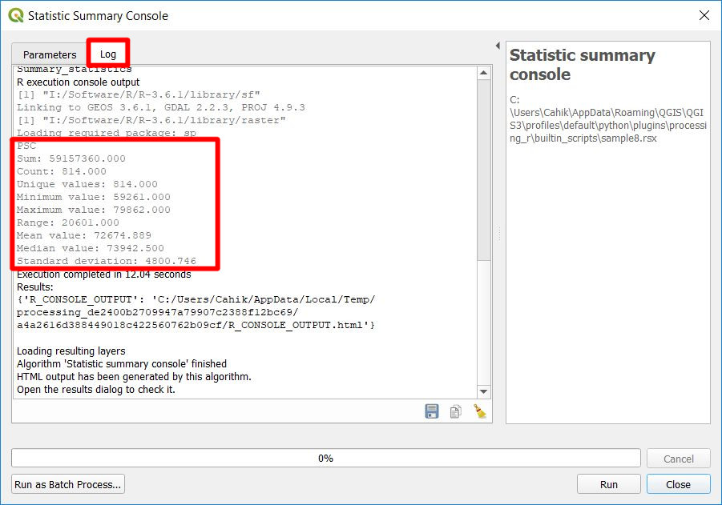

# Example with tool console log

This script takes input vector data and one of its fields. The result is a tool console log with summary statistics for a given field of the layer.

## Script

```
##Basic statistics=group
##Statistic summary console=name
##Layer=vector
##Field=Field Layer
Summary_statistics <- data.frame(rbind(
        sum(Layer[[Field]]),
        length(Layer[[Field]]),
        length(unique(Layer[[Field]])),
        min(Layer[[Field]]),
        max(Layer[[Field]]),
        max(Layer[[Field]])-min(Layer[[Field]]),
        mean(Layer[[Field]]),
        median(Layer[[Field]]),
        sd(Layer[[Field]])),
        row.names=c("Sum:","Count:","Unique values:","Minimum value:","Maximum value:","Range:","Mean value:","Median value:","Standard deviation:"))
colnames(Summary_statistics) <- c(Field)
>Summary_statistics
```

## Script lines description

1. **Basic statistics** is the group of the algorithm.
2. **Statistic summary console** is the name of the algorithm.
3. **Layer** is the input vector layer.
4. **Field** is the name of a field from _Layer_.
5. Create data.frame with calculated statistics and assign correct row names.
6. Give the data.frame correct colname, the name of the field.
7. Print the created data.frame to the tool console log.

The output will be shown in the tool console log.


